# Reptile-Torch
 

 

	

Reptile Torch is a PyTorch Implementation of the Meta-Learning Algorithm proposed in the paper ['Reptile: A Scalable Meta-Learning Algorithm'](https://openai.com/blog/reptile/) by [Alex Nichol](https://openai.com/blog/authors/alex/) and [John Schulman](https://openai.com/blog/authors/john/) from [OpenAI](https://openai.com/).

This code has been produced as part of the paper *'Meta-Learning Informative Priors for Bayesian Optimization'*, concerning the topic of Automated Machine Learning. For any questions or remarks feel free to contact the original author of the paper.

This project is licensed under the MIT License. Any reproduction of this work should reference the original author(s).

# Methodology

We provide a parallelized version of the [batched Reptile algorithm by Nichol & Schulman](https://arxiv.org/abs/1803.02999) using the [PyTorch](https://pytorch.org/) library. This method drastically improves the computational performance over the original implementation by relegating  the gradient learning tasks to the GPU. The specifics of our approach are listed in the topics below.

## Meta-Learning

The basic principle that is utilized by Reptile is that of Meta-Learning. The conceptual framework around this method is that we can derive a better estimate for the initialization parameters θ of a neural network by training those initializations on a generalized task structure.

Pre-training the initialization parameters of a neural network through Meta-Learning allows for convergence using significantly less data points. The paper ['Provable Guarantees for Gradient-Based Meta-Learning'](Provable%20Guarantees%20for%20Gradient-Based%20Meta-Learning) further argues that generalization of the Meta-Learned parameters improve with task-similarity. 

Evidently, the quality of the Meta-Learned parametrization depends on both the distribution and scope of the tasks within the learned task class. Meta-Learning methods are known to significantly outperform transfer-learning based methods if only few data are available. Combining both of these techniques as in ['Meta-Transfer Learning for Few-Shot Learning'](https://ieeexplore.ieee.org/document/8954051) has shown promising results.

## Reptile

The Reptile algorithm is a variant of the MAML algorithm from the paper ['Model-Agnostic Meta-Learning for Fast Adaptation of Deep Networks'](https://arxiv.org/abs/1703.03400) by Finn, Abbeel & Levine. Both MAML and Reptile are compatible with any model trained by gradient descent, such as Bayes by Backpropagation. The advantage of Reptile over MAML is that unlike MAML it doesn't require computation of expensive higher-order differentials and instead optimizes directly on the gradient.

> ## *Parallel Batched Reptile* 
> 1. &nbsp; Randomly Initialize Weight Parameters $\theta$
> 2. &nbsp; **for** Iteration = 1, 2, ... **do**
> 3. &nbsp; &nbsp; &nbsp; &nbsp; Sample Task Batch τ1, τ2, ... , τn
> 4. &nbsp; &nbsp; &nbsp; &nbsp; **for** Task = τ1, τ2, ... , τn **do**
> 5. &nbsp; &nbsp; &nbsp; &nbsp; &nbsp; &nbsp; &nbsp; 
> 6. &nbsp; &nbsp; &nbsp; &nbsp; **end**
> 7. &nbsp; &nbsp; &nbsp; &nbsp; 
> 8. &nbsp; **end**

Note here we batch for single gradient steps, taking more gradient steps before updating the initialization parameters would require computation of the nth order derivative.

## Torch

Using the above batch version of Reptile, we can implement parallelization of the loop from the 4th to the 6th step of the algorithm. We do this by using the `nn.Module` of PyTorch. Every training iteration we sample our batch of tasks, then using PyTorch we calculate the loss tensor using `nn.MSELoss` and perform backpropagation with `nn.backward` to update the meta initialization parameters. 

[//]: # (Results - Tensorboard)

# Usage Instructions

In this repository we have provided an easy to use [iPython notebook](https://github.com/dualslash/reptile-torch/blob/main/ReptileTorch.ipynb). The easiest way to use this is to upload the notebook to your own [Google Colab](https://colab.research.google.com/) repository. It can then be ran without any additional configuration required. If you would like to run the implementation on your local machine, you might need to pass some additional requirements.

## Requirements

This project requires the following specs and libraries to function:
* NVIDIA CUDA Capable GPU
* Python 3.6 or Above
	* Numpy
	* Pandas
* TensorFlow 2.x or Above
* PyTorch 1.7.x or Above

## Defining Tasks

Defining tasks is rather straightforward, in the notebook we have provided there is an example of a logistic distribution task which models the logistic distribution function given a sample of points x1, x2, ... xn.

Which translates into

    def  logistic(x, theta):
	    return theta[0]/(1 + np.exp(-1 * theta[1] * (x - theta[2])))
	    
Here θ0 = L, θ1 = k and θ2 = x0, which are the parameters that can vary across the tasks of this class. To Meta-Learn from this task, we randomly sample tasks from this class from uniformly sampled task parameters θi. 

## Running Experiments

In the notebook a straightforward experiment is provided, which return the cross-validated MSE in addition to a visualization of the training loss and individual batch performance. 

The following parameters are  available and their defaults:

|Parameter         | Default     | Parameter | Default          |
|------------------|-------------| --------------------- | ---- |
| Inner Step Size  | 0.02        | Evaluation Iterations | 32   |
| Inner Batch Size | 5           | Evaluation Batch Size | 10   |
| Outer Step Size  | 0.1         | Evaluation Range      |(1,11)|
| Outer Iterations | 10,000      | Sample Radius         | 4    |
| Meta Batch Size  | 10          | Sample Count          | 100  |
| Model Size       | 32          | Task            |   Logistic |

